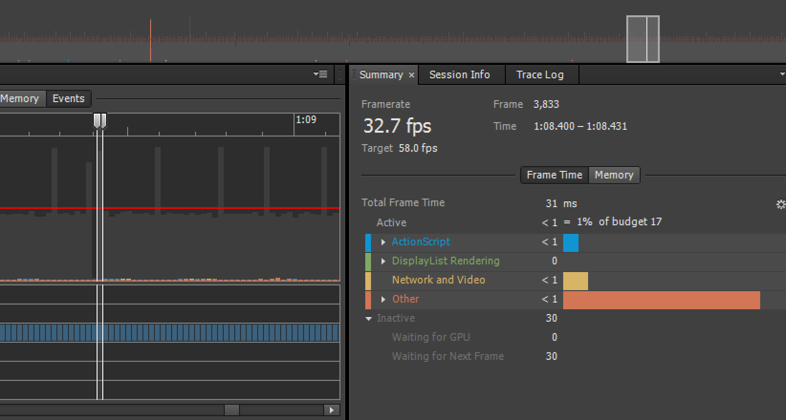
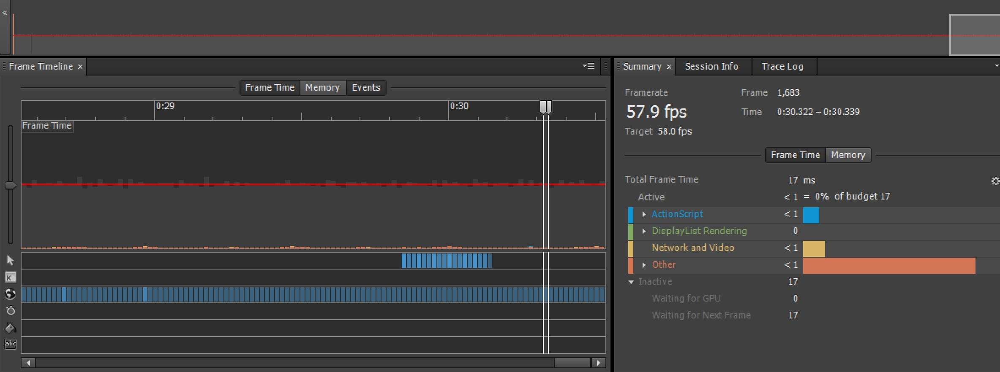
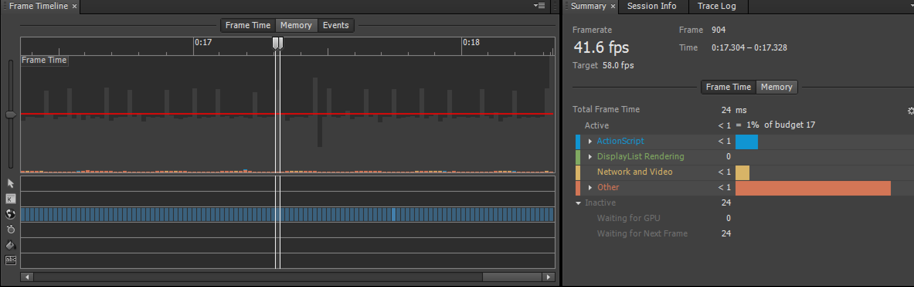

# AIRTimerResolution_ANE
Quick extension workaround for Adobe AIR's frame pacing issue regarding NtTimerResolution.
The AIR window TimerResolution appears to have a direct affect on additional delays found in 'Waiting for Next Frame'.

SWF versions above 37 appear to not properly set the NtTimerResolution to 1.0 ms, and this extension aims to give control to that

## NOTE That this extension has not been widely tested

### Components:
- `TimerResExtDLL`: Native library source to interface with `ntdll.dll`
- `TimerResExtension`: FlashDevelop ActionScript source for the extension
- `TimerResANE.ane`: Packaged Extension

### Requires:
- Adobe AIR SDK (~32.0.0.116)
- FlashDevelop
- Visual Studio 2019
- Visual C++ 2015 Redistributable (Also required on deployed application's device, otherwise DLL may not load!) 

### Building:
**Step 1:** Set up a directory with the contents of TimerResANE. For FlashDevelop, this directory must end in `.ane` (i.e. TimerResExt.ane)

**Step 2:** Set up FlashDevelop with TimerResExtension source & build. (AIR SDK 32.0.0.116)

**Step 3:** Build SWC using ``acompc -source-path src -include-classes io.improt.timerres.TimerResANE io.improt.timerres.TimerRes -output TimerResExt.swc`` in the base directory of TimerResExtension.
- You can find acompc.bat in `bin` in the AIR SDK

**Step 4:** Replace the two `library.swf` files in `\` and `\META-INF\ANE\Windows-x86\` from your TimerResANE directory, with the built SWF from Step 2. 
- (Built SWF is found in ``bin`` of the FlashDevelop directory. Note that it must be named library.swf)

**Step 5:** Build the native library using at least Visual Studio 2019. Double check that 'Release' and 'x86' are selected to build properly. You will need to configure the Include Directories to add the `include` directory from your Adobe AIR SDK. You will also need to add an additional dependency to the Linker pointing to `\lib\win\FlashRuntimeExtensions.lib` of your AIR SDK. 

**Step 6:** Replace ``TimerResExtDLL.dll`` from `\META-INF\ANE\Windows-x86\` with your newly compiled native DLL from Step 5.

**Step 7:** The extension should now be usable. You will need to link the SWC in the root to the resulting application SWF file. Your application.xml will also need the extension specified, as well as supporting `extendedDesktop` as a profile. Lastly, you may need to specify an extensions directory `extdir` containing the `*****.ane` folder during packaging or debugging.

```
...
  <extensions>
    <extensionID>TimerResExt</extensionID>
  </extensions>
  
  <supportedProfiles>extendedDesktop</supportedProfiles>
...
```

### How to use:
##### 1. Include the ANE in your AIR project & import with `io.improt.timerres.TimerResANE`
##### 2. Initialize the extension through ``TimerResANE.Init()``.
##### 3. Specify any target TimerResolution with ``TimerResANE.UpdateResolution(uint)`` 

``UpdateResolution(uint)`` accepts a positive value, where **1000** == a NtTimerResolution of 1.0 milliseconds. (500 = 0.5ms, etc).

The TimerResolution standard low for most devices seem to be ~1.0ms, though the extension will clamp between the system's minimum and maximum resolution. ``TimerResANE.UpdateResolution(0)`` will update to the lowest possible resolution of that device.

`Init()` and `UpdateResolution(uint)` both return true or false depending on if the action completed successfully.

`UpdateResolution` might return false for any of the following:
- NTDLL.dll could not be loaded.
- NtSetTimerResolution or NtQueryTimerResolution functions could not be resolved from NTDLL.dll
- STATUS_ACCESS_VIOLATION was returned from either setting or querying the TimerResolution
- The resulting TimerResolution somehow increased in interval as a result of updating it.

`Init` should only return false if the `createExtensionContext` fails to return an ExtensionContext

##### 4. The extension can be destroyed using ``TimerResANE.dispose();``


## Comparisons & Issue Description

##### Default Frame Limiting on latest AIR SDK, NtTimerResolution @ 15.621ms (default)

*Total Frame Time -> 58.0 FPS + 15.621ms*

##### Default Frame Limiting with TimerResANE::UpdateResolution(0) implemented, NtTimerResolution @ 0.496ms


##### NtTimerResolution @ 8.0ms - Frame Spikes now ~24ms

*Total Frame Time -> 58.0FPS + 8.0ms* 

##### Old vs. New SWF version NtTimerResolution behavior
**Old (`-swf-version` <=37)**:


**New (`-swf-version` >=38)**:


*Older SWF Versions below 38 lock resolution @ 1.0ms. New behavior seems to not affect timer resolution and add to frame times. This extension allows control over this until the issue is fixed.*
